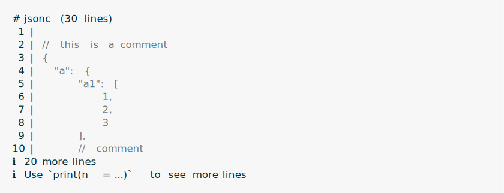
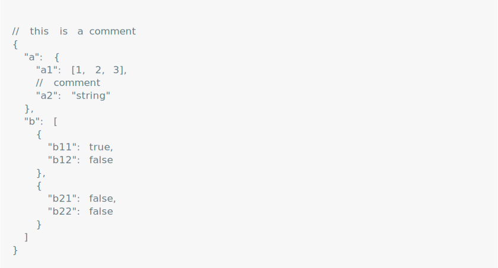
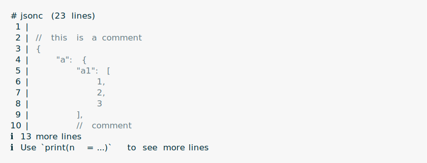
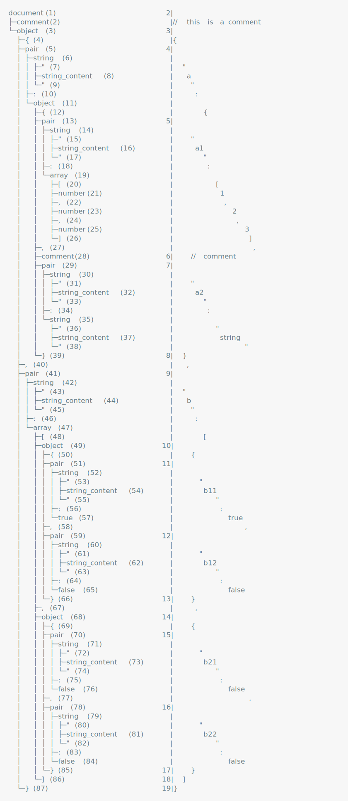
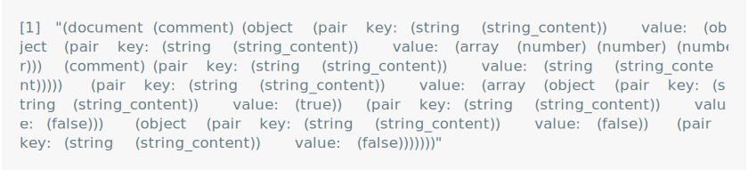

<!-- README.md is generated from README.Rmd. Please edit that file -->

# ts

<!-- badges: start -->


[](https://github.com/r-lib/ts/actions/workflows/R-CMD-check.yaml)
<!-- badges: end -->

Common tree-sitter parsing tools for R.

ts is a common interface to
[tree-sitter](https://tree-sitter.github.io/tree-sitter/) parsers,
implemented in other R packages. It has a common API to

- query,
- edit,
- format, and
- unserialize

tree-sitter parse trees.

## Installation

You can install the development version of ts from
[GitHub](https://github.com/) with:

``` r
# install.packages("pak")
pak::pak("r-lib/ts")
```

## Documentation

See at
[`https://r-lib.github.io/ts/`](https://r-lib.github.io/ts/reference/index.html)
and also in the installed package: `help(package = "ts")`.

## Parsers that use ts

- JSONC (JSON with comments and trailing commas):
  [tsjsonc](https://gaborcsardi.github.io/tsjsonc/).
- TOML: [tstoml](https://gaborcsardi.github.io/tstoml/).

## Quickstart

In this document I show examples with the `tsjsonc` package.

### Create a tree-sitter tree

Create a ts_tree (ts_tree_jsonc) object from a string:

``` r
txt <- r"(
// this is a comment
{
  "a": {
    "a1": [1, 2, 3],
    // comment
    "a2": "string"
  },
  "b": [
    {
      "b11": true,
      "b12": false
    },
    {
      "b21": false,
      "b22": false
    }
  ]
}
)"

json <- tsjsonc::ts_parse_jsonc(txt)
```

Pretty print a ts_tree object:

``` r
json
```

<picture>
<source media="(prefers-color-scheme: dark)" srcset="man/figures/print-json-dark.svg">
 </picture>

### Select nodes of a tree

Selecting nodes is the basis of editing and querying tree-sitter trees.

Select element by objects key:

``` r
ts_tree_select(json, "a")
```

<picture>
<source media="(prefers-color-scheme: dark)" srcset="man/figures/select-key-dark.svg">
 </picture>

Select element inside element:

``` r
ts_tree_select(json, "a", "a1")
```

<picture>
<source media="(prefers-color-scheme: dark)" srcset="man/figures/select-select-dark.svg">
 </picture>

Select element(s) of an array:

``` r
ts_tree_select(json, "a", "a1", 1:2)
```

<picture>
<source media="(prefers-color-scheme: dark)" srcset="man/figures/select-array-dark.svg">
 </picture>

Select multiple keys from an object:

``` r
ts_tree_select(json, "a", c("a1", "a2"))
```

<picture>
<source media="(prefers-color-scheme: dark)" srcset="man/figures/select-multiple-dark.svg">
 </picture>

Select nodes that match a tree-sitter query:

``` r
json |> ts_tree_select(query = "((pair value: (false) @val))")
```

<picture>
<source media="(prefers-color-scheme: dark)" srcset="man/figures/select-query-dark.svg">
 </picture>

### Delete elements

Delete selected elements:

``` r
ts_tree_select(json, "a", "a1") |> ts_tree_delete()
```

<picture>
<source media="(prefers-color-scheme: dark)" srcset="man/figures/delete-dark.svg">
 </picture>

### Insert elements

Insert element into an array:

``` r
ts_tree_select(json, "a", "a1") |> ts_tree_insert(at = 2, "new")
```

<picture>
<source media="(prefers-color-scheme: dark)" srcset="man/figures/insert-array-dark.svg">
 </picture>

Inserting into an array reformats the array.

Insert element into an object, at the specified key:

``` r
ts_tree_select(json, "a") |>
  ts_tree_insert(key = "a0", at = 0, list("new", "element"))
```

<picture>
<source media="(prefers-color-scheme: dark)" srcset="man/figures/insert-object-dark.svg">
 </picture>

### Update elements

Update existing element:

``` r
ts_tree_select(json, "a", c("a1", "a2")) |> ts_tree_update("new value")
```

<picture>
<source media="(prefers-color-scheme: dark)" srcset="man/figures/update-dark.svg">
 </picture>

Inserts the element if some parents are missing:

``` r
json <- ts_parse_jsonc(text = "{ \"a\": { \"b\": true } }")
json
```

<picture>
<source media="(prefers-color-scheme: dark)" srcset="man/figures/update-insert-dark.svg">
 </picture>

``` r
ts_tree_select(json, "a", "x", "y") |> ts_tree_update(list(1,2,3))
```

<picture>
<source media="(prefers-color-scheme: dark)" srcset="man/figures/update-insert-2-dark.svg">
 </picture>

### Write out a document

Use `stdout()` to write it to the screen instread of a file:

``` r
json |> ts_tree_write(stdout())
```

<picture>
<source media="(prefers-color-scheme: dark)" srcset="man/figures/write-dark.svg">
 </picture>

### Formatting

Format the whole document:

``` r
json |> ts_tree_format()
```

<picture>
<source media="(prefers-color-scheme: dark)" srcset="man/figures/format-dark.svg">
 </picture>

Format part of the document:

``` r
json |> ts_tree_select("a") |>
  ts_tree_format(options = list(format = "compact"))
```

<picture>
<source media="(prefers-color-scheme: dark)" srcset="man/figures/format-part-dark.svg">
 </picture>

### Unserializing

Unserialize a whole document:

``` r
json |> ts_tree_unserialize()
```

<picture>
<source media="(prefers-color-scheme: dark)" srcset="man/figures/unserialize-dark.svg">
 </picture>

Note that `ts_tree_unserialize()` always returns a list, the first
element of the list is the unserialized document.

Unserialize part(s) of the document:

``` r
json |> ts_tree_select("b") |> ts_tree_unserialize()
```

<picture>
<source media="(prefers-color-scheme: dark)" srcset="man/figures/unserialize-part-dark.svg">
 </picture>

Again, `ts_tree_unserialize()` returns a list, with one element for each
selected node.

### Exploring a tree-sitter tree

It is often useful to explore the structure of a (JSONC) tree-sitter
tree, to help writing the right selection or tree-sitter queries.

Print the annotated syntax tree:

``` r
ts_tree_ast(json)
```

<picture>
<source media="(prefers-color-scheme: dark)" srcset="man/figures/syntax-tree-dark.svg">
 </picture>

Print the document object model:

``` r
ts_tree_dom(json)
```

<picture>
<source media="(prefers-color-scheme: dark)" srcset="man/figures/document-model-dark.svg">
 </picture>

Print the structural summary of a tree:

``` r
ts_tree_sexpr(json)
```

<picture>
<source media="(prefers-color-scheme: dark)" srcset="man/figures/structure-dark.svg">
 </picture>

# License

MIT © Posit Software, PBC
